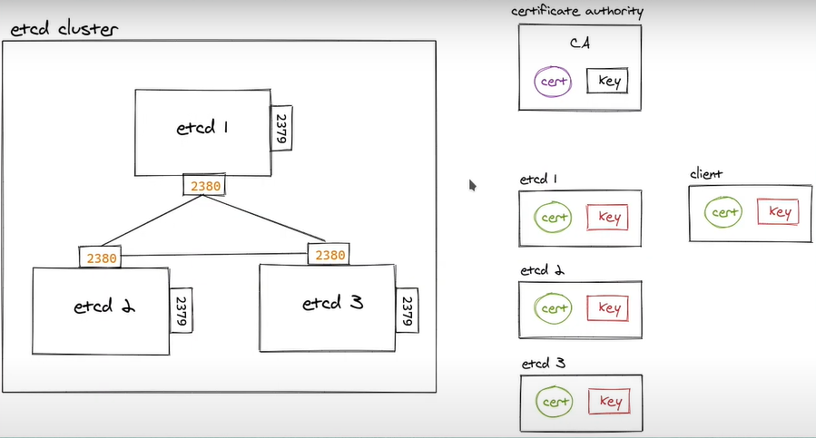
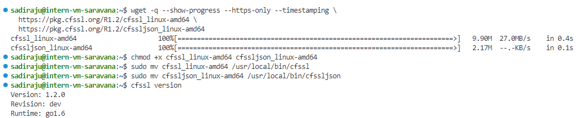
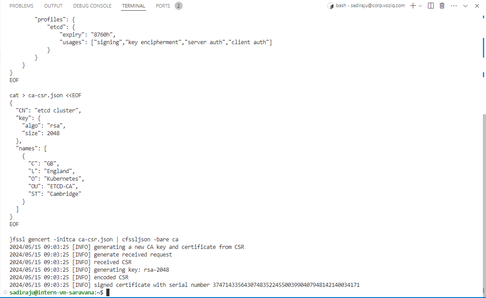
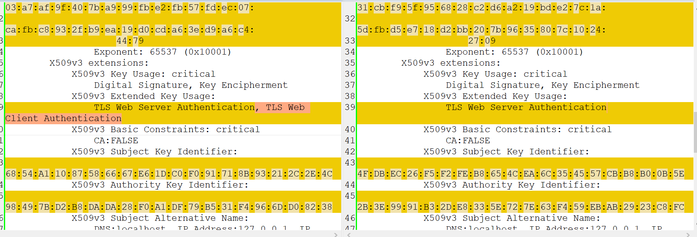
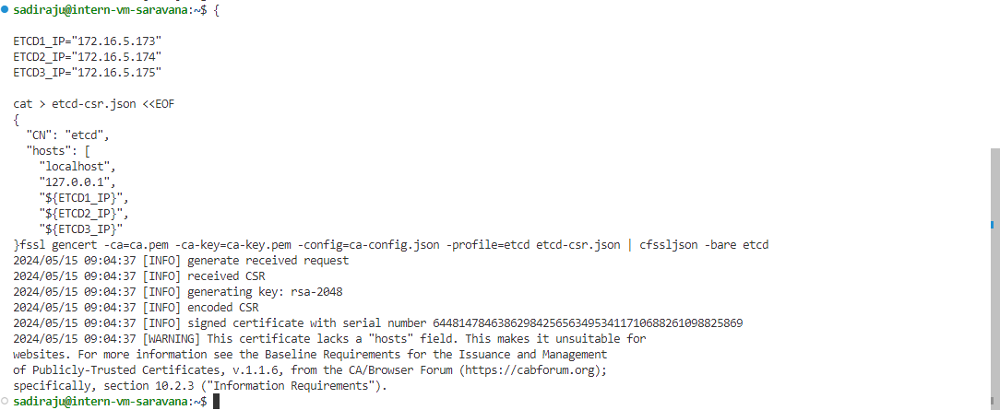
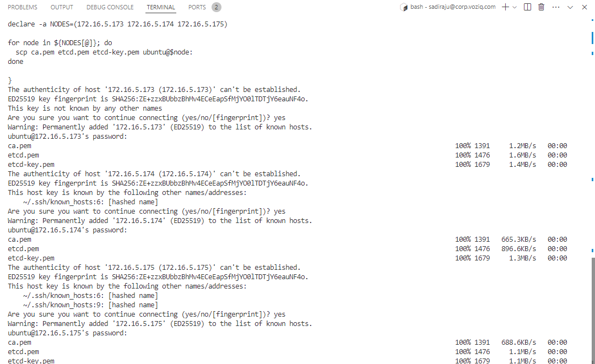
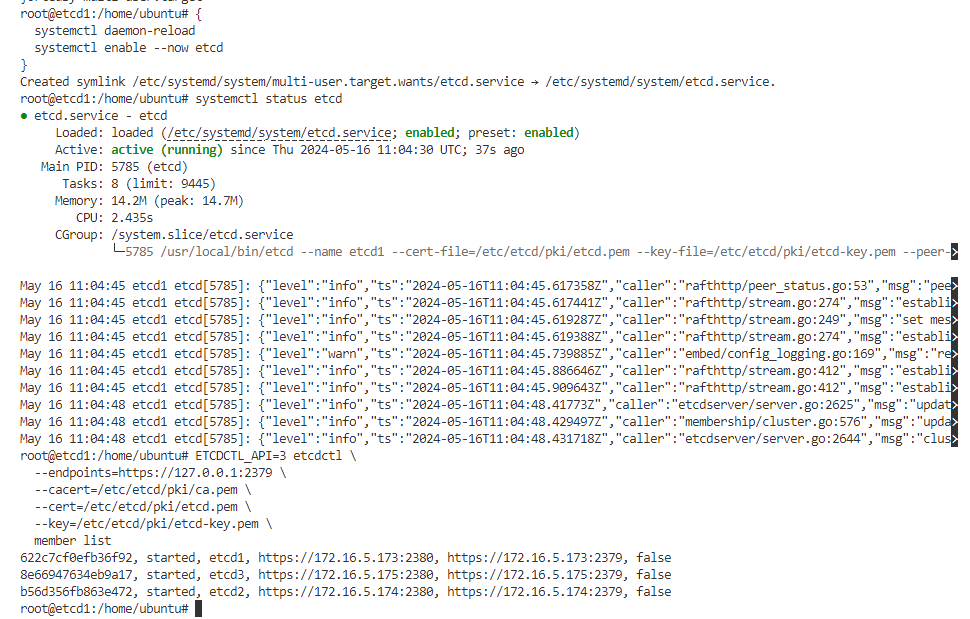
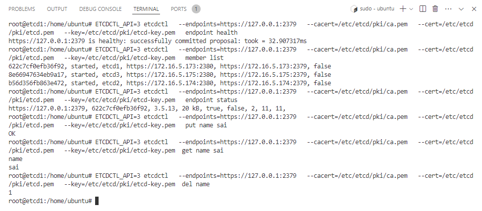

# ETCD CLUSTER SETUP

## What is ETCD ?

ETCD is an open source distributed key-value store used to hold and manage the critical information that distributed systems need to keep running. Most notably, it manages the configuration data, state data, and metadata for Kubernetes

## Why are we using it? 

It’s no small task to serve as the data backbone that keeps a distributed workload running. But etcd is built for the task, designed from the ground up for the following qualities:

* Fully replicated: Every node in an etcd cluster has access the full data store.
* Highly available: etcd is designed to have no single point of failure and gracefully tolerate hardware failures and network partitions.
* Secure: etcd supports automatic Transport Layer Security (TLS) and optional secure socket layer (SSL) client certificate authentication. Because etcd stores vital and highly sensitive configuration data

## External etcd uses and creation process

External etcd: In external etcd mode, etcd is deployed on a separate set of nodes from the Kubernetes control plane components as shown below. The advantage of external etcd mode is that you can use dedicated data backup and restore strategies separate from the Kubernetes control plane component nodes. However, the downside is that you would need three extra physical or virtual nodes to run etcd separately


## What are TLS Certificates?

An SSL/TLS certificate is a digital object that allows systems to verify the identity & subsequently establish an encrypted network connection to another system using the Secure Sockets Layer/Transport Layer Security (SSL/TLS) protocol.

SSL/TLS certificates thus act as digital identity cards to secure network communications, establish the identity of websites over the Internet as well as resources on private networks.



# Basic ETCD Cluster Creation

## Download etcd & etcdctl binaries from Github

```bash
{
  ETCD_VER=v3.5.13 # latest version
  # version you can specify here
  wget -q --show-progress "https://github.com/etcd-io/etcd/releases/download/${ETCD_VER}/etcd-${ETCD_VER}-linux-amd64.tar.gz"
  tar zxf etcd-v3.5.13-linux-amd64.tar.gz
  mv etcd-v3.5.13-linux-amd64/etcd* /usr/local/bin/
  rm -rf etcd*
}
```
## Create systemd unit file for etcd service
Set NODE_IP to the correct IP of the machine where you are running this
```bash
NODE_IP=$(hostname --ip-address)

ETCD_NAME=$(hostname -s)

ETCD1_NAME="k8s-etcd-1"
ETCD2_NAME="k8s-etcd-2"
ETCD3_NAME="k8s-etcd-3"


ETCD1_IP="172.16.5.173"
# For multi-node ETCD cluster you can add as shown below 
ETCD2_IP="172.16.5.174"
ETCD3_IP="172.16.5.175"


cat <<EOF >/etc/systemd/system/etcd.service
[Unit]
Description=etcd

[Service]
Type=exec
ExecStart=/usr/local/bin/etcd \\
  --name ${ETCD_NAME} \\
  --initial-advertise-peer-urls http://${NODE_IP}:2380 \\
  --listen-peer-urls http://${NODE_IP}:2380 \\
  --advertise-client-urls http://${NODE_IP}:2379 \\
  --listen-client-urls http://${NODE_IP}:2379,http://127.0.0.1:2379 \\
  --initial-cluster-token etcd-cluster-1 \\
  --initial-cluster ${ETCD1_NAME}=http://${ETCD1_IP}:2380,${ETCD2_NAME}=http://${ETCD2_IP}:2380,${ETCD3_NAME}=http://${ETCD3_IP}:2380 \\
  --initial-cluster-state new
Restart=on-failure
RestartSec=5

[Install]
WantedBy=multi-user.target
EOF
```

## Enable and Start etcd service

```bash
{
  systemctl daemon-reload
  systemctl enable --now etcd
}
```

## Verify Etcd cluster status
```bash
ETCDCTL_API=3 etcdctl --endpoints=http://127.0.0.1:2379 member list

# OUTPUT
#e234ec5fa712ca20, started, ubuntu-24-04, https://172.16.5.167:2380, https://172.16.5.167:2379, false
```

# ETCD Cluster with Security (TLS Certificates)

## Download required binaries

### cfssl utility
cfssl is the command line tool to issue/sign/bundle client certificate. It's also a tool to start a HTTP server to handle web requests for signing, bundling and verification. 

### cfssljson utility
Most of the output from cfssl is in JSON. The cfssljson utility can take this output and split it out into separate key, certificate, CSR, and bundle files as appropriate. The tool takes a single flag, -f, that specifies the input file, and an argument that specifies the base name for the files produced.

```bash
# get the latest cfssl version here or set manually.
# CFSSL_VERSION="1.6.5"

VERSION=$(curl --silent "https://api.github.com/repos/cloudflare/cfssl/releases/latest" | grep '"tag_name"' | cut --delimiter '"' --fields 4)
# output is v1.6.5
# remove v from this.
CFSSL_VERSION=${VERSION#"v"}
# the #"" is a bash string manipulation

# download the latest packages cfssljson and cfssllinux and rename them.

wget --quiet --show-progress --https-only --timestamping https://github.com/cloudflare/cfssl/releases/download/v${CFSSL_VERSION}/cfssljson_${CFSSL_VERSION}_linux_amd64 --output-document cfssljson

wget --quiet --show-progress --https-only --timestamping https://github.com/cloudflare/cfssl/releases/download/v${CFSSL_VERSION}/cfssl_${CFSSL_VERSION}_linux_amd64 --output-document cfssl

chmod +x cfssl cfssljson
sudo mv cfssl* /usr/local/bin/

cfssl version
cfssljson -version
```





## Create a CA (Certificate Authority) 

We can use this CA to generate TLS Certificates
```bash
{

cat > ca-config.json <<EOF
{
    "signing": { 
        "default": {
            "expiry": "8760h"
        },
        "profiles": {
            "etcd": {
                "expiry": "8760h",
                "usages": ["signing","key encipherment","server auth","client auth"]
            }
        }
    }
}
EOF
cat > ca-csr.json <<EOF
{
  "CN": "etcd cluster",
  "key": {
    "algo": "rsa",
    "size": 2048
  },
  "names": [
    {
      "C": "GB",
      "L": "England",
      "O": "Kubernetes",
      "OU": "ETCD-CA",
      "ST": "Cambridge"
    }
  ]
}
EOF

cfssl gencert -initca ca-csr.json | cfssljson -bare ca

}
# signing - root object that contains configuration related to signing certs.
# default - default settings for all certs unless specified by a profile.
# expiry  - default duration for which cert is valid(1 yr)
# profiles - collection of named profiles for diff types of certs
# etcd - profile specifically configured for etcd 
# expiry - expiry duration specific to the etcd profile
# usages - the allowed uses for the certs issued under this profile.


# CN - common name for the CA Certificate.
# key - conf for the key to be generated.
# algo - the algorith to use, here it is rsa 
# size - size of the key, it is 2048 bits 
# names - list of objects containing fields for the subject of the certificate.
  # C - Country 
  # L - Locality 
  # O - Organization 
  # OU - Organizational Unit
  # ST - State or Province 

# to list all the security files generated after this command:

# sadiraju@intern-vm-saravana:~$ ls 
# ca-key.pem  ca.pem  ca.csr 

# gencert - generates certificate and private keys.
# This script creates ca.pem and ca-key.pem certificate and keys.
# OUTPUT 
# 2024/05/10 17:13:36 [INFO] generating a new CA key and certificate from CSR
# 2024/05/10 17:13:36 [INFO] generate received request
# 2024/05/10 17:13:36 [INFO] received CSR
# 2024/05/10 17:13:36 [INFO] generating key: rsa-2048
# 2024/05/10 17:13:37 [INFO] encoded CSR
# 2024/05/10 17:13:37 [INFO] signed certificate with serial number 17526978457328923847272420551561308084309363650
```

## Check Certificate Details:

Use tools like openssl to inspect the certificate details and verify the key usages

```bash
openssl x509 -in /path/to/certificate.crt -text -noout
```

check the differences incase of any errors still persisting to check the details of certificates generated in a clear way.
Use tools like Winmerge to view the differences between two files.



## Create TLS Certificates 

```bash
{

ETCD1_IP="172.16.5.173"
ETCD2_IP="172.16.5.174"
ETCD3_IP="172.16.5.175"

cat > etcd-csr.json <<EOF
{
  "CN": "etcd",
  "hosts": [
    "localhost",
    "127.0.0.1",
    "${ETCD1_IP}",
    "${ETCD2_IP}",
    "${ETCD3_IP}"
  ],
  "key": {
    "algo": "rsa",
    "size": 2048
  },
  "names": [
    {
      "C": "GB",
      "L": "England",
      "O": "Kubernetes",
      "OU": "etcd",
      "ST": "Cambridge"
    }
  ]
}
EOF

cfssl gencert -ca=ca.pem -ca-key=ca-key.pem -config=ca-config.json -profile=etcd etcd-csr.json | cfssljson -bare etcd

}
# to list all the security files generated after this command:
# sadiraju@intern-vm-saravana:~$ ls *.pem
# ca-key.pem  ca.pem  etcd-key.pem  etcd.pem

# Here we are using already generated Certificate Authority(CA) to sign the newly generated certificate.
# It creates files such as etcd.pem and etcd-key.pem 

# OUTPUT
# 2024/05/10 17:19:32 [INFO] generate received request
# 2024/05/10 17:19:32 [INFO] received CSR
# 2024/05/10 17:19:32 [INFO] generating key: rsa-2048
# 2024/05/10 17:19:33 [INFO] encoded CSR
# 2024/05/10 17:19:33 [INFO] signed certificate with serial number 433698268221053635048925700928001178443264530744
```


## Copy the Certificates to ETCD nodes

As we have generated the certificates and private keys in our local workspace, we need to move them to the ETCD vm's in our ETCD Cluster.
 
```bash

{
declare -a NODES=(172.16.5.173 172.16.5.174 172.16.5.175)

for node in ${NODES[@]}; do
  scp ca.pem etcd.pem etcd-key.pem ubuntu@$node: 
done
}

# OUTPUT
# The authenticity of host '172.16.5.167 (172.16.5.167)' can't be established.
# ED25519 key fingerprint is SHA256:ZE+zzxBUbbzBhMv4ECeEapSfMjYO0lTDTjY6eauNF4o.
# This key is not known by any other names.
# Are you sure you want to continue connecting (yes/no/[fingerprint])? yes
# Warning: Permanently added '172.16.5.167' (ED25519) to the list of known hosts.
# ubuntu@172.16.5.167's password: 
# ca.pem                                                                                              100% 1391     1.4MB/s   00:00    
# etcd.pem                                                                                            100% 1460     1.1MB/s   00:00    
# etcd-key.pem 
```


## On All ETCD nodes
### Copy the certificates to a standard location

```bash
{
  mkdir -p /etc/etcd/pki
  mv ca.pem etcd.pem etcd-key.pem /etc/etcd/pki/ 
}

#  To Remove certs on each node 
{
  rm -R /etc/etcd/pki
}
```

## Downloading git binaries of  ETCD Latest Version
```bash
{
  ETCD_VER=v3.5.13 # latest version as of 16-05-2024
  wget -q --show-progress "https://github.com/etcd-io/etcd/releases/download/${ETCD_VER}/etcd-${ETCD_VER}-linux-amd64.tar.gz"
  tar zxf etcd-v3.5.13-linux-amd64.tar.gz
  mv etcd-v3.5.13-linux-amd64/etcd* /usr/local/bin/
  rm -rf etcd*
}
```

## Create a Systemd Unit file for ETCD Service

Set NODE_IP to the correct IP of the machine where you are running this

```bash
{

NODE_IP=$(hostname --ip-address)

ETCD_NAME=$(hostname --short)

ETCD1_NAME="k8s-etcd-1"
ETCD2_NAME="k8s-etcd-2"
ETCD3_NAME="k8s-etcd-3"

ETCD1_IP="172.16.5.173"
ETCD2_IP="172.16.5.174"
ETCD3_IP="172.16.5.175"

cat <<EOF >/etc/systemd/system/etcd.service
[Unit]
Description=etcd

[Service]
Type=notify
ExecStart=/usr/local/bin/etcd \\
  --name ${ETCD_NAME} \\
  --data-dir=/var/lib/etcd \\
  --cert-file=/etc/etcd/pki/etcd.pem \\
  --key-file=/etc/etcd/pki/etcd-key.pem \\
  --peer-cert-file=/etc/etcd/pki/etcd.pem \\
  --peer-key-file=/etc/etcd/pki/etcd-key.pem \\
  --trusted-ca-file=/etc/etcd/pki/ca.pem \\
  --peer-trusted-ca-file=/etc/etcd/pki/ca.pem \\
  --peer-client-cert-auth \\
  --client-cert-auth \\
  --initial-advertise-peer-urls https://${NODE_IP}:2380 \\
  --listen-peer-urls https://${NODE_IP}:2380 \\
  --advertise-client-urls https://${NODE_IP}:2379 \\
  --listen-client-urls https://${NODE_IP}:2379,https://127.0.0.1:2379 \\
  --initial-cluster-token external-etcd-cluster \\
  --initial-cluster ${ETCD1_NAME}=https://${ETCD1_IP}:2380,${ETCD2_NAME}=https://${ETCD2_IP}:2380,${ETCD3_NAME}=https://${ETCD3_IP}:2380 \\
  --initial-cluster-state new
Restart=on-failure
RestartSec=5

[Install]
WantedBy=multi-user.target
EOF

}
```

##  Manual Command for ETCD Setup 

``` bash
/usr/local/bin/etcd --name k8s-etcd-1 --data-dir=/var/lib/etcd --cert-file=/etc/etcd/pki/etcd.pem --key-file=/etc/etcd/pki/etcd-key.pem --peer-cert-file=/etc/etcd/pki/etcd.pem   --peer-key-file=/etc/etcd/pki/etcd-key.pem --trusted-ca-file=/etc/etcd/pki/ca.pem --peer-trusted-ca-file=/etc/etcd/pki/ca.pem  --peer-client-cert-auth --client-cert-auth --initial-advertise-peer-urls https://172.16.5.175:2380 --listen-peer-urls https://172.16.5.175:2380   --advertise-client-urls https://172.16.5.175:2379 --listen-client-urls https://172.16.5.175:2379,https://127.0.0.1:2379 --initial-cluster-token external-etcd-cluster --initial-cluster k8s-etcd-1=https://172.16.5.173:2380,k8s-etcd-2=https://172.16.5.174:2380,k8s-etcd-3=https://172.16.5.175:2380  --initial-cluster-state new
```

## Enable and etcd Service

```bash
{
  systemctl daemon-reload
  systemctl enable --now etcd
}
```


## Interacting with ETCD
### Without using ENV Variables
```bash
ETCDCTL_API=3 etcdctl \
  --endpoints=https://127.0.0.1:2379 \
  --cacert=/etc/etcd/pki/ca.pem \
  --cert=/etc/etcd/pki/etcd.pem \
  --key=/etc/etcd/pki/etcd-key.pem \
  member list

  # OUTPUT 
  # 622c7cf0efb36f92, started, etcd1, https://172.16.5.173:2380, https://172.16.5.173:2379, false
  # 8e66947634eb9a17, started, etcd3, https://172.16.5.175:2380, https://172.16.5.175:2379, false
  # b56d356fb863e472, started, etcd2, https://172.16.5.174:2380, https://172.16.5.174:2379, false

```
### Using ENV Variables 

Better to export these as environment variables and connect to the clutser instead of a specific node. 

Reference:

[https://github.com/etcd-io/etcd/tree/main/etcdctl](https://github.com/etcd-io/etcd/tree/main/etcdctl)

Prefix flag strings with ETCDCTL_, convert all letters to upper-case, and replace dash(-) with underscore(_).
Using Environment Variables we can reduce the size of the command everytime you use.
```bash
export ETCDCTL_ENDPOINTS=https://127.0.0.1:2379 
export ETCDCTL_CACERT=/etc/etcd/pki/ca.pem
export ETCDCTL_CERT=/etc/etcd/pki/etcd.pem
export ETCDCTL_KEY=/etc/etcd/pki/etcd-key.pem

# Now run this commands

etcdctl member list

# OUTPUT
# 622c7cf0efb36f92, started, k8s-etcd-1, https://172.16.5.173:2380, https://172.16.5.173:2379, false
# 8e66947634eb9a17, started, k8s-etcd-3, https://172.16.5.175:2380, https://172.16.5.175:2379, false
# b56d356fb863e472, started, k8s-etcd-2, https://172.16.5.174:2380, https://172.16.5.174:2379, false

etcdctl endpoint status
etcdctl endpoint health
```

 ### Troubleshoot Error 1
 ```bash
  {"level":"warn","ts":"2024-05-13T10:32:29.076868Z","logger":"etcd-client","caller":"v3@v3.5.13/retry_interceptor.go:62","msg":"retrying of unary invoker failed","target":"etcd-endpoints://0xc00041c000/127.0.0.1:2379","attempt":0,"error":"rpc error: code = DeadlineExceeded desc = latest balancer error: last connection error: connection error: desc = \"transport: Error while dialing: dial tcp 127.0.0.1:2379: connect: connection refused\""}
```

### Solution 

```bash
  systemctl restart etcd.service
```

### Troubleshoot Error 2

```bash 
{"level":"warn","ts":"2024-05-22T06:13:32.839203Z","caller":"embed/config_logging.go:169","msg":"rejected connection","remote-addr":"172.16.5.175:42982","server-name":"","error":"tls: failed to verify certificate: x509: certificate specifies an incompatible key usage"}
```
### Solution

```bash
This part of the message suggests that the certificate being used has key usage restrictions that are not compatible with the operation attempted. You might need to regenerate the certificate with the correct key usages. For ETCD, ensure that the certificate includes usages such as serverAuth and clientAuth if it’s used for both server and client authentication.

"usages": ["signing","key encipherment","server auth","client auth"]
# Make sure you add this usages property correctly in the Certificate Authority.
```      

### Troubleshoot Error 3
```bash
"msg":"creating peer listener failed","error":"listen tcp 172.16.5.173:2380: bind: address already in use
```

### Solution 
```
systemctl stop etcd.service
systemctl daemon-reload 
```

### Troubleshoot Error 4
```bash
{"level":"warn","ts":"2024-05-21T13:29:21.884754Z","caller":"embed/config.go:679","msg":"Running http and grpc server on single port. This is not recommended for production."
}
```
### Solution 
```bash
 Separate Ports  : Configure your HTTP and gRPC servers to run on separate ports. This separation helps in better management, security, and performance.
```


